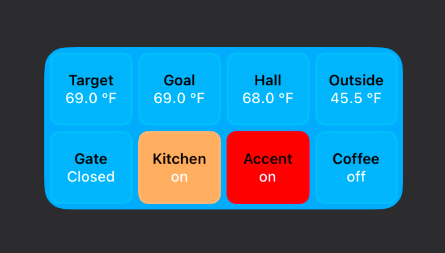

# Scriptable Widgets for Home Assistant

## Columns

* Ideal for displaying multiple entities in a small space
* Entity states can be colored to match Home Assistant

## Tiles

* A less dense layout than the columns widget
* Inspired by the Apple Home Accessories widget
* Supports "secondary info", similar the the Home Assistant Entities card
* Entity states and tile backgrounds can be colored to match Home Assistant

## Entity

* Displays a single entity
* Supports "secondary info", similar the the Home Assistant Entities card
* Widget background can be colored to match the entity

## Lock Screen

### Rectangular

* Displays multiple entities
* Designed to be used as a rectangular lock screen widget

